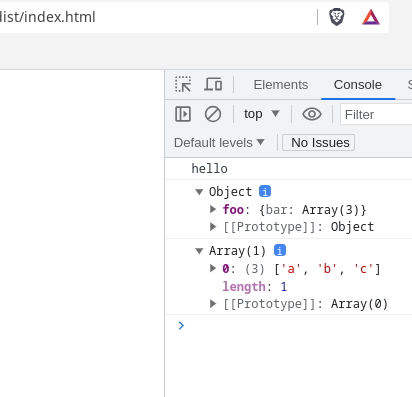

# Output Management

Direct to the point we need to install and configure one more thing to be able to process and copy and paste the html to `dist` directory and add extra code to `webpack.config.js`. [See](https://webpack.js.org/guides/output-management/#setting-up-htmlwebpackplugin)

```console
npm install html-webpack-plugin -D
```

```js
const HtmlWebpackPlugin = require('html-webpack-plugin');

plugins: [
  new HtmlWebpackPlugin({
    title: 'Foo',
  }),
],
```

Since this will add more files every time on `dist` directory, it is good for us to clean the things on each run.

```js
output: {
  filename: '[name].bundle.js',
  path: path.resolve(__dirname, 'dist'),
  clean: true,  < ------------------------------------
},
```

Now we can see some things in the browser:



